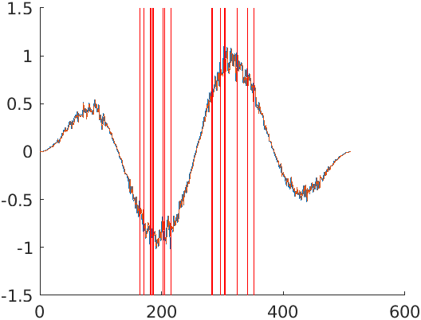

# Noise detector for EEG data
## Introduction
To use, first train a model with ```fitAr```, which takes as its parameters the
training data, the sample time (inverse of sample rate) and the maximum order
for the autoregressive model to be trained. The function trains and tests
autoregressive models of varying orders up to the maximum order and then returns the
model with the best fit to the data. Now one can performa a walk forward estimation
on new data with ```walkForwardEstimate```, which walks over the data and produces a
one sample-ahead estimation on the data. The function ```errorsOfWalkForward``` takes
as its parameters the data that was walked over and the estimate and produces a matrix
containing the error of each estimate along with the sample index of each error in the
original data. This error matrix may be culled with the ```cullErrors``` function, which
takes as its parameters an error matrix and a threshold. All errors below the threshold
will be filtered out of the error matrix.

## Example
(The following code snippets may be found in ```test/example.m```.)
First, prepare some training data:
```m
% training data
sampleRate = 2048;
sampleTime = 1 / sampleRate;
stopTime = 0.25;
t = (0:sampleTime:stopTime-sampleTime)';
measurementError = 0.1 .* randn(sampleRate * stopTime, 1) + 1;
data = sin(4*pi*t) .* sin(16*pi*t) .* measurementError;
```
Next, train the autoregressive model with the data
```m
% train the model
model = fitAr(data, sampleTime, 1);
estimate = walkForwardEstimate(model, data);
```
Now we may plot the errors as vertical lines using the ```line``` function
```m
order = modelOrder(model);
% the estimate starts from the order + 1th element of the original array, since
% the first order elements are only used to predict
window = data(order + 1:numel(data));
errors = errorsOfWalkForward(data, estimate);
threshold = 0.175;
culled = cullErrors(errors, threshold);
fig=figure; 
hax=axes; 
hold on
plot(window);
plot(estimate);
for i = 1:size(culled,1)
	sample = culled(i,2);
	line([sample sample],get(hax,'YLim'),'Color',[1 0 0])
end
hold off
```
Here is the plot produced. The blue line is the actual data while the orange line is the estimate.
The red lines indicate the points where the prediction error was above the threshold (0.175):



## Example with EEG data
(The following code snippets may be found in ```test/test0.m```.
This example requires the [EEGLAB toolbox](https://github.com/sccn/eeglab)).

First, we prepare the training data, train our model and plot the errors:
```m
%% get train data and predict model
home_path = 'D:\UH\data_analysis\school_intervention_study_data\EEG_data\double_check_0815\1_chan_corr_maha_pre2\'
file_struct = dir([home_path '*.set'])
len = length(file_struct );
 for i = 1:len
    subject_list{i}=file_struct(i).name;
 end
subject = subject_list{1};

EEG = pop_loadset('filename',subject, 'filepath',home_path);

cleanData = double(EEG.data(:)).';
model = fitAr(cleanData, 1/500, 1);
%% plot estimation for clean data

data = double(EEG.data(1,:)).';
estimate = walkForwardEstimate(model, data);
order = modelOrder(model);
% the estimate starts from the order + 1th element of the original array, since
% the first order elements are only used to predict
window = data(order + 1:numel(data));
errors = errorsOfWalkForward(data, estimate);
threshold =  mean(errors(:,1)) + n_var * std(errors(:,1));
culled   = cullErrors(errors, threshold);  

fig=figure;
hax=axes;
hold on
plot(window);
plot(estimate);
for i = 1:size(culled,1)
		sample = culled(i,2);
		line([sample sample],get(hax,'YLim'),'Color',[1 0 0])
end
hold off
```

Next we plot the estimates along with the data with EEGLAB's plotting facilities:
```m
 home_path = 'D:\UH\data_analysis\school_intervention_study_data\EEG_data\data_science_course\set\filt\';
file_struct = dir([home_path '*.set'])
len = length(file_struct );
 for i = 1:len
    subject_list{i}=file_struct(i).name;
 end
 
 %%

for s = 1;
    subject = subject_list{s};
    EEG     = pop_loadset('filename',subject, 'filepath',home_path); 
  

    plot = plotnoise0(EEG, ...
        'nchan',2,...
        'dur',1,...
        'srate', 250,...
        'n_var', 2.5,...
        'plotmodel',false )
    
    nchan   = 2;   % the number of estimated channels
    dur     = 1;   % duration per segment
    srate   = 250; % sample rate
    n_var   = 2.5;   % number of variance for threshold
    plotmodel = 0;   % logical; if plot fit model or not
    
    plot = plotnoise0(EEG,model, nchan, dur, srate, n_var, plotmodel)
end
```
